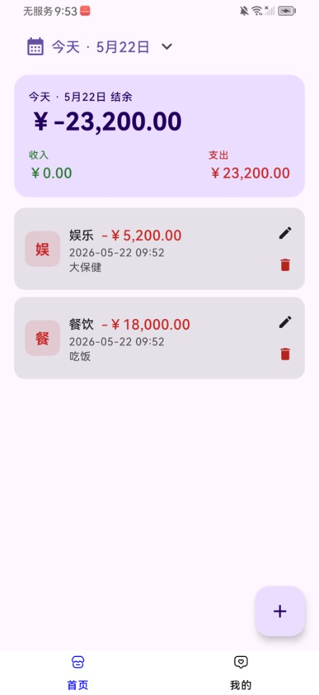
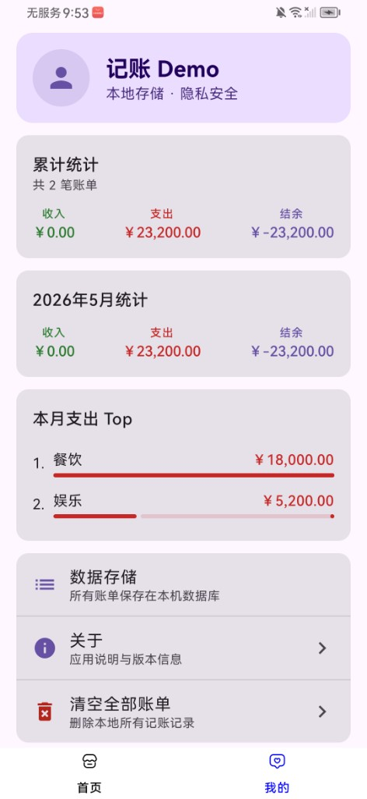
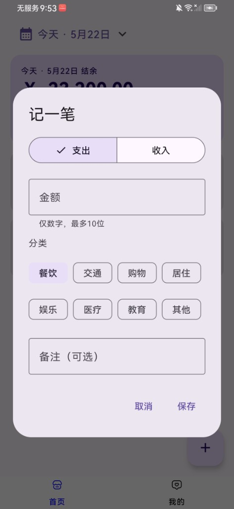
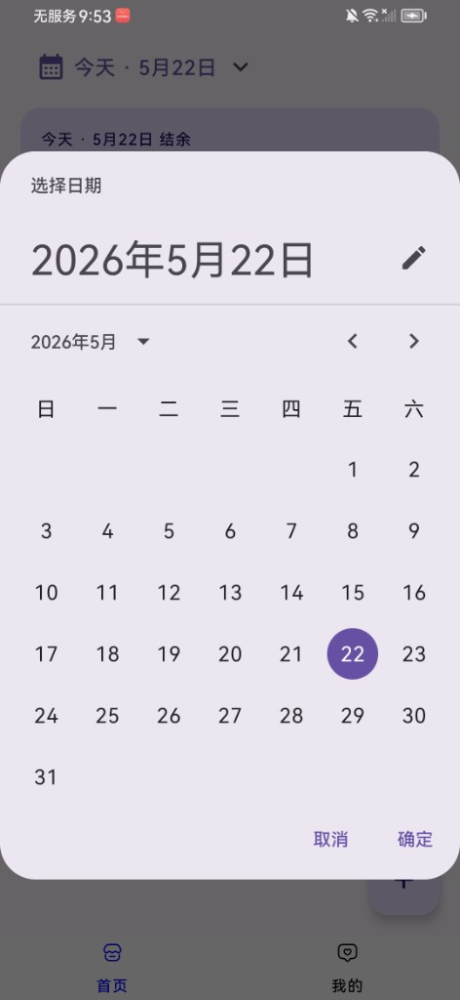

# ComposeApplication · 记账 Demo

这是一个基于 **[Cursor](https://cursor.com)** AI 辅助开发的 Android 本地记账测试项目。从底部导航框架起步，逐步迭代为具备完整记账流程、日期筛选与个人中心统计的 Compose 应用。

> 数据仅保存在本机 Room 数据库，无账号、无云端同步，适合学习与功能验证。

---

## 界面预览    

### 首页

按日查看账单列表，展示当日收入、支出与结余汇总。



### 我的

累计与本月统计、支出分类排行，以及数据管理与关于入口。



### 记一笔

新增或编辑账单，支持收入/支出切换、分类选择与金额校验。



### 日期选择

点击顶部日期打开日历，选择任意一天查看对应账单。



---

## 功能概览

| 模块 | 说明 |
|------|------|
| **首页** | 按日筛选账单、收入/支出/结余汇总、账单列表增删改查 |
| **记一笔** | 收入/支出、分类、金额（数字限制最多 10 位）、备注 |
| **日期** | 日历选择具体日期，默认显示当天数据 |
| **我的** | 累计/本月统计、支出分类 Top、清空数据、关于 |

---

## 技术栈

- **语言**：Kotlin
- **UI**：Jetpack Compose + Material3
- **架构**：ViewModel + Repository
- **本地存储**：Room（KSP）
- **最低 SDK**：24 · **目标 SDK**：36

---

## 运行方式

1. 使用 Android Studio 打开本项目根目录
2. 等待 Gradle 同步完成
3. 连接设备或启动模拟器，运行 `app` 模块

命令行构建：

```bash
./gradlew assembleDebug
```

---

## 项目目录说明

```
ComposeApplication/                 # 项目根目录
├── app/                            # 应用主模块（唯一业务模块）
│   ├── build.gradle.kts            # 模块构建配置、依赖声明
│   ├── proguard-rules.pro          # Release 混淆规则（当前未开启混淆）
│   └── src/
│       ├── main/                   # 主源码与资源
│       │   ├── AndroidManifest.xml # 应用入口、Application 注册
│       │   ├── java/com/shx/composeapplication/
│       │   │   ├── MainActivity.kt           # 主 Activity，底部 Tab + 横向分页
│       │   │   ├── AccountingApplication.kt  # Application，提供全局 Repository
│       │   │   ├── entity/                   # 通用 UI 实体（如底部导航项）
│       │   │   ├── data/                     # 数据层
│       │   │   │   ├── entity/               # Room 表实体（账单记录）
│       │   │   │   ├── dao/                  # 数据库访问接口
│       │   │   │   ├── database/             # Room Database 单例
│       │   │   │   ├── repository/           # 数据仓库，封装 CRUD 与查询
│       │   │   │   └── model/                # 业务枚举/常量（类型、分类等）
│       │   │   ├── ui/
│       │   │   │   ├── home/                 # 首页：列表、筛选、记账弹窗、ViewModel
│       │   │   │   ├── profile/              # 我的：统计、设置、ViewModel
│       │   │   │   └── theme/                # Compose 主题、颜色、字体
│       │   │   └── util/                     # 工具类（金额过滤、日期、格式化）
│       │   └── res/                          # Android 资源
│       │       ├── drawable/                 # 矢量图（启动图标前景/背景等）
│       │       ├── drawable-xxhdpi/          # 位图资源（底部栏图标等）
│       │       ├── mipmap-*/                 # 应用启动图标各密度
│       │       ├── values/                   # 字符串、颜色、主题
│       │       └── xml/                      # 备份与数据提取规则
│       ├── test/                             # 本地单元测试（JVM）
│       │   └── java/.../ExampleUnitTest.kt
│       └── androidTest/                      # 仪器化测试（需设备/模拟器）
│           └── java/.../ExampleInstrumentedTest.kt
├── gradle/
│   ├── libs.versions.toml          # 版本目录（依赖与插件版本统一管理）
│   └── wrapper/                    # Gradle Wrapper，保证构建版本一致
├── build.gradle.kts                # 根工程构建脚本（声明子模块插件）
├── settings.gradle.kts             # 工程设置，包含 `:app` 模块
├── gradle.properties               # Gradle / Android 全局属性
├── docs/
│   └── screenshots/                # README 界面截图资源
├── .idea/                          # Android Studio / IDEA 工程配置（本地）
├── .kotlin/                        # Kotlin 编译缓存（本地，可忽略）
└── README.md                       # 本说明文件
```

### 源码包职责速查

| 包路径 | 用途 |
|--------|------|
| `data/entity` | 与数据库表一一对应的数据类 |
| `data/dao` | SQL 查询、插入、更新、删除 |
| `data/database` | Room 数据库创建与单例 |
| `data/repository` | 对 UI/ViewModel 暴露的数据操作 API |
| `data/model` | `RecordType`、预设分类等业务模型 |
| `ui/home` | 首页界面、记账表单、日期筛选栏 |
| `ui/profile` | 我的页面、统计展示、清空/关于 |
| `ui/theme` | Material3 主题与动态取色 |
| `util` | 金额输入过滤、日期范围、金额/时间格式化 |
| `entity` | 与数据库无关的轻量 UI 数据结构 |

### 构建产物目录（无需提交版本库）

| 目录 | 说明 |
|------|------|
| `app/build/` | 编译输出、APK、KSP 生成代码等 |
| `.gradle/` | Gradle 缓存 |

---

## 数据库

- **文件名**：`accounting_demo.db`
- **表**：`account_records`（金额、类型、分类、备注、创建时间戳）

---

## 开发说明

本项目在 Cursor 中通过对话式需求逐步完善，典型迭代包括：

1. 底部导航 + 横向分页骨架  
2. Room 本地库与记账 CRUD  
3. 按日筛选与日历选日期  
4. 我的页面统计与数据管理  
5. UI 细节（列表布局、金额校验、状态栏间距等）

如需二次开发，建议从 `ui/home`、`data/repository` 入手扩展统计、导出、自定义分类等功能。

---

## 许可证

本项目为个人学习 / 测试用途，未单独声明开源协议时可按仓库所有者约定使用。
