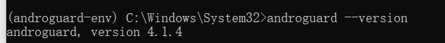
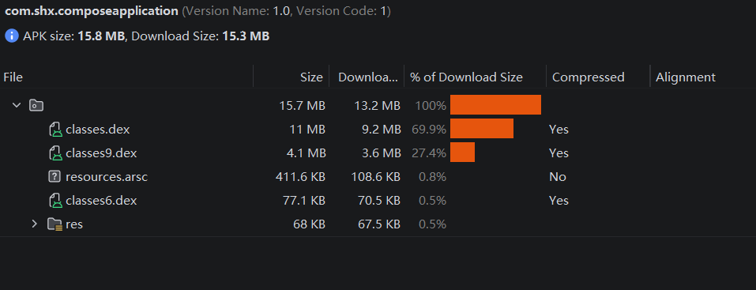
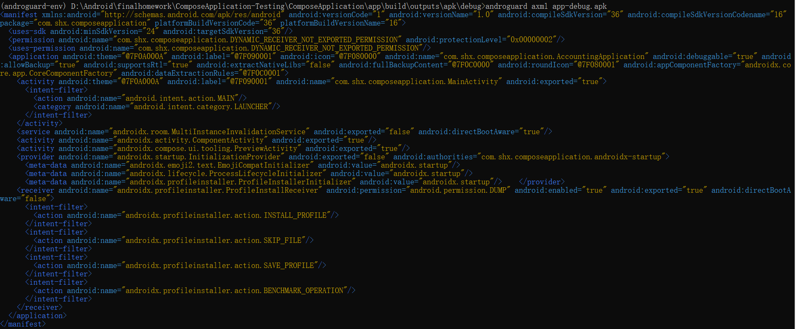
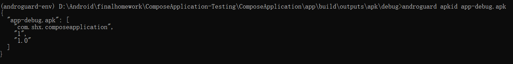
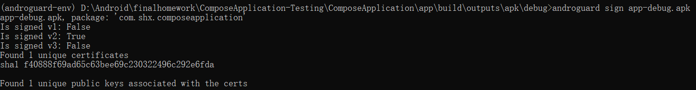
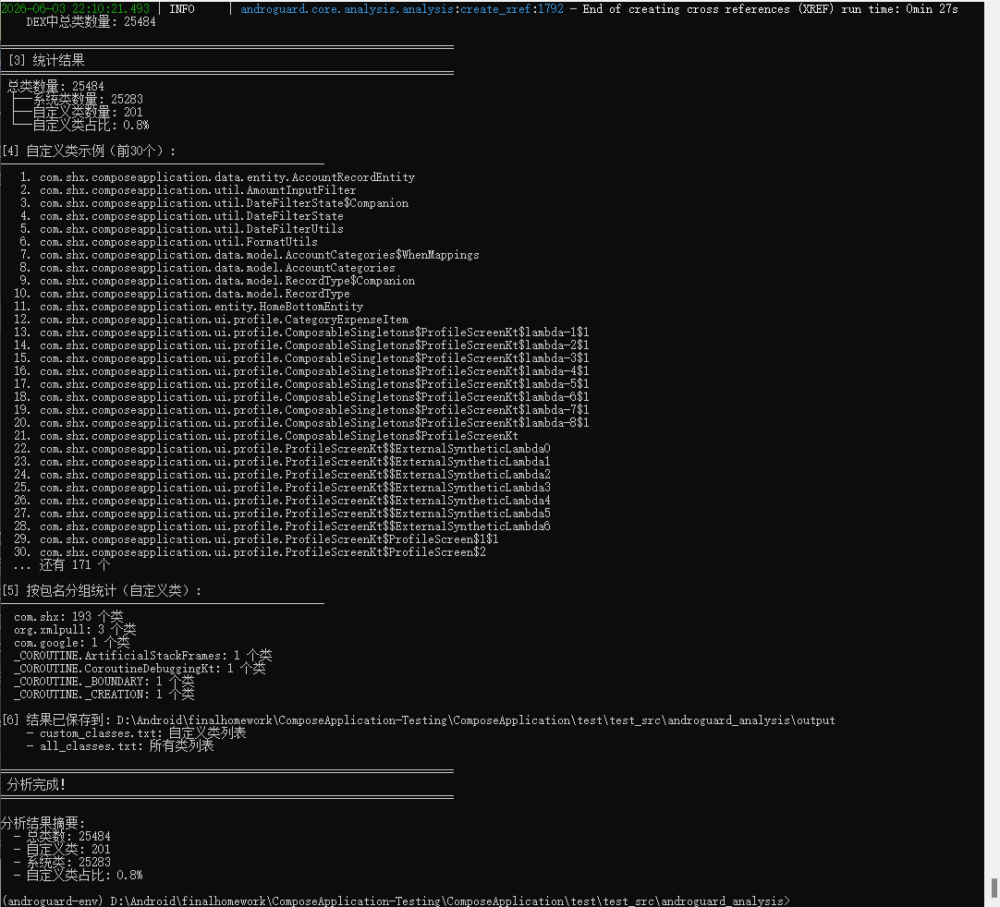
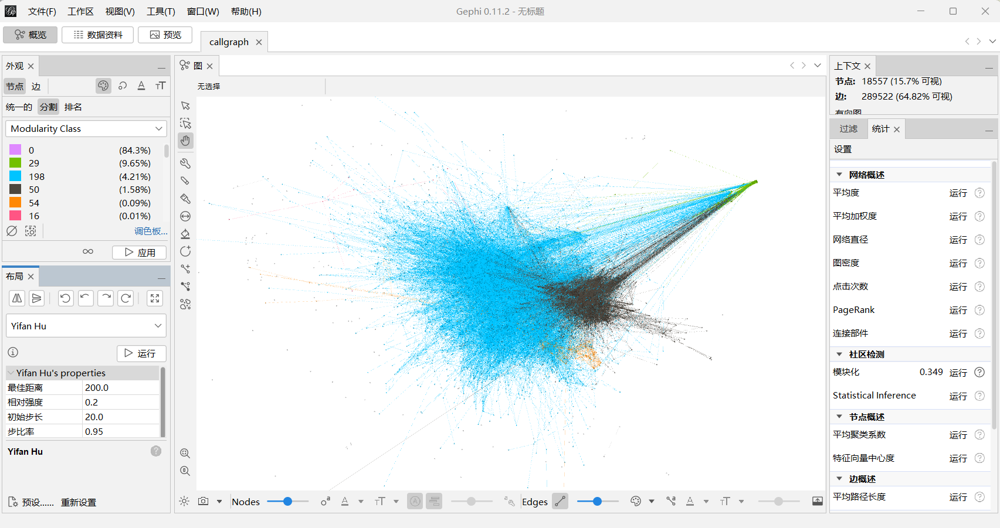

# 静态分析报告 
# 一、 Android Lint
## 1 执行概要
本次静态分析使用 Android Studio 内置的 Lint 工具对整个 ComposeApplication 项目进行了代码检查。
分析结果可见lint_report.html
## 2. 问题统计
| 分类 | 子类别 | 警告数量 |
|------|--------|----------|
| Android Lint: Correctness | Obsolete Android Gradle Plugin Version | 1 |
| Android Lint: Correctness | Obsolete Gradle Dependency | 6 |
| Android Lint: Performance | Unused Resources | 8 |
| **总计** | - | **15** |
## 3. 问题详细分析

### 3.1 版本过旧
1. Android Lint: Correctness - Obsolete Android Gradle Plugin Version（1个警告）

| 文件 | 行号 | 当前版本 | 可用新版本 | 问题描述 |
|------|------|----------|------------|----------|
| `gradle/libs.versions.toml` | 2 | 8.13.2 | 9.2.1 | Android Gradle Plugin版本过旧 |

**影响分析**：
- AGP（Android Gradle Plugin）是Android构建工具的核心，旧版本可能缺少新功能、性能优化和安全补丁
- 从8.13.2到9.2.1是大版本更新，可能包含构建性能优化和对新版Gradle的支持

**修复建议**：
```toml
# 将 libs.versions.toml 中的版本号修改为：
agp = "9.2.1"
```

2. Android Lint: Correctness - Obsolete Gradle Dependency（6个警告）

|依赖库	| 当前版本	 | 最新版本 | 文件行号 |
|------|-------|------|-----|
|androidx.core:core-ktx	| 1.10.1 | 1.16.0 | 44 |
|androidx.test.ext:junit	| 1.1.5	 | 1.3.0 | 80  |
|androidx.lifecycle:lifecycle-runtime-ktx| 2.6.1 |2.9.4| 126 |
|androidx.activity:activity-compose| 1.8.0	| 1.8.2	| 156 |
|androidx.compose:compose-bom	| 2024.09.00 | 2026.02.01| 182 |
|com.google.devtools.ksp	| 2.0.21-1.0.28 | 2.3.2	| 223 |

**修复建议**：

在 gradle/libs.versions.toml 中逐一更新版本号

### 3.2 未使用资源
1. 未使用的颜色资源（7个）
**文件**：app/src/main/res/values/colors.xml

| 资源ID   | 	行号   |
|---------------------|-------|
| R.color.purple_200	| 3| 	
| R.color.purple_500| 	4| 
| R.color.purple_700  | 	5| 
| R.color.teal_200    | 	6| 
| R.color.teal_700	   | 7     | 
| R.color.black	| 8     | 
| R.color.white	| 9     | 

**说明**：这些是Android Studio创建新项目时默认生成的颜色，项目中实际使用的是Material3主题的颜色系统，这些默认颜色未被引用。

2. 未使用的图片资源（1个）
|资源ID|	文件路径|
|---------------------|-------|
|R.drawable.shop_ic_store_line_order	|res/drawable-xxhdpi/shop_ic_store_line_order.webp|

**说明**：这个图标可能是早期版本遗留，或者是从模板中带来的，当前代码中没有使用。

**修复建议**：

- 删除未使用的颜色资源（7行代码）
- 删除未使用的图片文件（约节省几KB~几十KB）

**预计优化效果**：

- 减少APK体积约 5-10KB
- 减少资源索引表大小
- 提高构建速度（减少无用资源处理）

## 4. 整体评价
该项目代码质量良好，没有发现任何错误级别的问题。15个警告全部属于优化建议类：
- 依赖管理：需要定期更新依赖版本以获取最新特性和安全补丁
- 资源管理：清理未使用的资源可以减小APK体积，提升构建效率

# 二、Androguard
## 1. 准备工作
### 1.1安装Androguard
创建独立环境 ，原因：避免anaconda中各种包版本与之冲突
```toml
#创建新环境（Python 3.9）
conda create -n androguard-env python=3.9 -y --insecure
#激活新环境
conda activate androguard-env
#在新环境中安装 Androguard（使用清华镜像）
pip install androguard[magic,GUI] -i http://pypi.tuna.tsinghua.edu.cn/simple --trusted-host pypi.tuna.tsinghua.edu.cn
#验证
androguard --version
```
安装成功截图
### 1.2生成APK
在Android Studio中，Build -> Generate App Bundles or APKs -> Generate APKs。
构建成功后，在 app/build/outputs/apk/debug/ 下找到 app-debug.apk。
如图所示

---
## 2.使用Androguard命令分析
### 2.1运行的命令
具体命令有：
```toml
Commands:
analyze      Open a IPython Shell and start reverse engineering.
apkid        Prints the packageName/versionCode/versionName per APK as...
arsc         Decode resources.arsc either directly from a given file or...
axml         Parse the AndroidManifest.xml.
cg           Create a call graph based on the data of Analysis and...
decompile    Decompile an APK and create Control Flow Graphs.
disassemble  Disassemble Dalvik Code with size SIZE starting from an...
dtrace       Start dynamically an installed APK on the phone and start...
dump         Start and dump dynamically an installed APK on the phone
sign         Return the fingerprint(s) of all certificates inside an APK.
trace        Push an APK on the phone and start to trace all...
```
### 2.2 分析结果
1. 运行的命令及截图
**运行命令**：
- androguard axml app-debug.apk	  查看 AndroidManifest.xml
- androguard apkid app-debug.apk  查看包名、版本号（快速）
- androguard sign app-debug.apk	   查看证书签名

**运行结果**：




2. 具体分析
表1：应用基本信息

| 属性         | 值 |
|------------|---|
| 包名         | com.shx.composeapplication |
| 版本号        | 1 |
| 版本名        | 1.0 |
|  最小 SDK    | 24 (Android 7.0) |
| 目标 SDK     | 36 (Android 16) |
| 应用类        | com.shx.composeapplication.AccountingApplication |
| 主 Activity | com.shx.composeapplication.MainActivity |
| 可调试        | true (调试版本) |

表2：四大组件统计

| 组件类型 | 数量 | 名称列表 |
|------|----|------|
| Activity | 	3 | MainActivity (自定义，启动入口)|
| ComponentActivity |    | (AndroidX) |
| PreviewActivity | | (AndroidX Compose) |
| Service | 	1| 	MultiInstanceInvalidationService (Room 库) |
| Receiver | 	1| 	ProfileInstallReceiver (ProfileInstaller 库) |
| Provider | 	1| 	InitializationProvider (Startup 库) |

表3：组件数量汇总（图表用）

|组件类型 | 数量 |
|-----|----|
|Activities|	3|
|Services|	1|
|Receivers|	1|
|Providers|	1|

表4：权限分析

| 类型	    |权限名称|
|--------|----|
| 自定义权限	 |com.shx.composeapplication.DYNAMIC_RECEIVER_NOT_EXPORTED_PERMISSION|
| 使用的权限	 |com.shx.composeapplication.DYNAMIC_RECEIVER_NOT_EXPORTED_PERMISSION|

表5：签名信息

| 项目	           | 值     |
|---------------|-------|
| V1 签名 (JAR)	  | False |
| V2 签名 (全APK)	 | True  |
| V3 签名 (密钥轮换)	 | False |
| 唯一证书数量	       |1|
| 证书 SHA1 指纹	   |f40888f69ad65c63bee69c230322496c292e6fda|

---
## 3.自定义类统计分析
### 3.1 分析目的
使用 Androguard 对应用的 APK 文件进行反编译分析，
统计其中的自定义类数量（排除 Android SDK、AndroidX、Kotlin 标准库、Java 标准库等系统类），并按包名分组分析项目结构。
以便
- 评估应用代码规模：了解应用有多少是自己编写的代码
- 分析项目架构：按包名分组，了解各模块的代码分布
- 为代码审查提供依据：识别主要的功能模块

### 3.2 分析过程
1. 创建 analyze_classes.py脚本，位置：test_src/androguard_analysis
2. 在上述创建的新环境中python analyze_classes.py，执行结果如下
和output中的txt
### 3.3 分析结果
**总体统计**：自定义类总数	201 个

**自定义类示例（按功能分类）**
- 数据层（data 包）
```text
com.shx.composeapplication.data.entity.AccountRecordEntity    # 账单实体
com.shx.composeapplication.data.database.AppDatabase          # Room 数据库
com.shx.composeapplication.data.dao.AccountRecordDao          # 数据访问接口
com.shx.composeapplication.data.repository.AccountRepository  # 数据仓库
com.shx.composeapplication.data.model.AccountCategories       # 分类枚举
com.shx.composeapplication.data.model.RecordType              # 收支类型枚举
```

- 首页模块（ui.home）
```text
com.shx.composeapplication.ui.home.HomeViewModel          # 首页 ViewModel
com.shx.composeapplication.ui.home.HomeScreenKt           # 首页 UI
com.shx.composeapplication.ui.home.HomeUiState            # UI 状态
com.shx.composeapplication.ui.home.AccountSummary         # 账单统计
com.shx.composeapplication.ui.home.RecordFormDialogKt     # 记账弹窗
com.shx.composeapplication.ui.home.DateFilterBarKt        # 日期筛选栏
```

- 个人中心模块（ui.profile）
```text
com.shx.composeapplication.ui.profile.ProfileViewModel    # 个人中心 ViewModel
com.shx.composeapplication.ui.profile.ProfileScreenKt     # 个人中心 UI
com.shx.composeapplication.ui.profile.ProfileUiState      # UI 状态
com.shx.composeapplication.ui.profile.CategoryExpenseItem # 分类支出项
```

- 工具类（util）
```text
com.shx.composeapplication.util.DateFilterState    # 日期状态
com.shx.composeapplication.util.DateFilterUtils    # 日期工具
com.shx.composeapplication.util.FormatUtils        # 格式化工具
com.shx.composeapplication.util.AmountInputFilter  # 金额输入过滤器
```

**架构分析结论**

|维度	| 分析结果                      |
|---------------|---------------------------|
|架构模式	| MVVM（Model-View-ViewModel） |
|代码规模	| 201 个自定义类，中等规模应用          |
|模块分布	| UI 层占比最高（~60%），数据层次之（~15%） |
|UI 框架	| Jetpack Compose（大量 Composable 生成类） |
|数据存储	| Room 数据库                  |
|代码质量	| 结构清晰，分层明确，符合 Android 最佳实践 |

---
## 4.调用图

### 4.1 分析目的

调用图（Call Graph）是软件工程中用于表示程序内部方法之间调用关系的有向图。通过对 ComposeApplication 应用进行调用图分析，旨在实现以下目标：
- 理解代码结构：可视化展示方法之间的调用关系，理清代码的依赖层次
- 识别关键入口点：找到应用的核心入口方法
- 分析模块划分：通过聚类观察各功能模块的边界和耦合程度
- 评估代码复杂度：通过节点数和边数评估应用的规模和复杂度

### 4.2 执行步骤

#### 4.2.1生成调用图

使用 Androguard 提供的 `cg` 命令生成调用图：

```bash
cd D:\Android\finalhomework\ComposeApplication-Testing\ComposeApplication\app\build\outputs\apk\debug
androguard cg -o callgraph.gml app-debug.apk
```

**参数说明**：
- `cg`：Call Graph 命令
- `-o callgraph.gml`：输出文件名为 `callgraph.gml`（GML 格式）
- `app-debug.apk`：待分析的 APK 文件

**文件位置**：build\outputs\apk\debug\callgraph.gml

#### 4.2.2 可视化

使用 **Gephi** 开源图可视化工具打开生成的 `callgraph.gml` 文件：

1. 下载安装 [Gephi](https://gephi.org/)
2. `File` → `Open` → 选择 `callgraph.gml`
3. 选择布局算法 `Yifan Hu`
4. 进行各种统计
5. 调整节点大小和颜色（按模块类排名）

**整体视图**：

#### 4.2.3 分析结果
1. **统计结果**

| 指标 | 数值 | 说明 |评价 |
|-----|------|------|------|
| 节点数（方法数） | 118,203 | 应用中包含的所有方法总数 |规模较大 |
| 边数（调用关系） | 446,681 | 方法之间的调用关系总数 |调用关系密集 |
| 平均度 | 15.602 | 每个方法平均调用/被调用约 15.6 次 ||
| 网络直径 | 10 | 图中最远的两个节点距离为 10 步 |调用链深度合理 |
| 平均路径长度 | 3.048 | 任意两个方法平均只需约 3 步即可到达 ||
| 图密度 | 0.001 | 图较稀疏，节点间连接不密集 |稀疏图，耦合度可控 |
| 模块化值 | 0.349 | 存在一定的社区结构 ||

2. **连通性分析**

| 指标     | 数值 | 说明 |
|--------|------|------|
| 弱连通分量数 | 198 | 图分成 198 个弱连通区域 |
| 强连通分量数 | 18,551 | 大量方法间存在单向依赖 |
| 社区数量   | 202 | 模块化算法识别出 202 个功能模块 |

3. **模块化类（Modularity Class）分布**

通过 Gephi 的模块化算法，将节点按功能聚类：

| 模块 ID | 节点占比 | 推测功能 |
|---------|---------|----------|
| **0** | **84.3%** | 主应用代码（UI + 业务逻辑） |
| **29** | 9.65% | 可能是第三方库或数据层 |
| **198** | 4.21% | 可能是工具类模块 |
| **50** | 1.58% | 小功能模块 |
| **54** | 0.09% | 边缘代码 |
| 其他（6,7,23,25,91,1,2,3,4） | <0.01% | 极小模块 |


