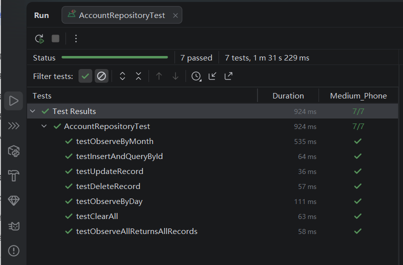
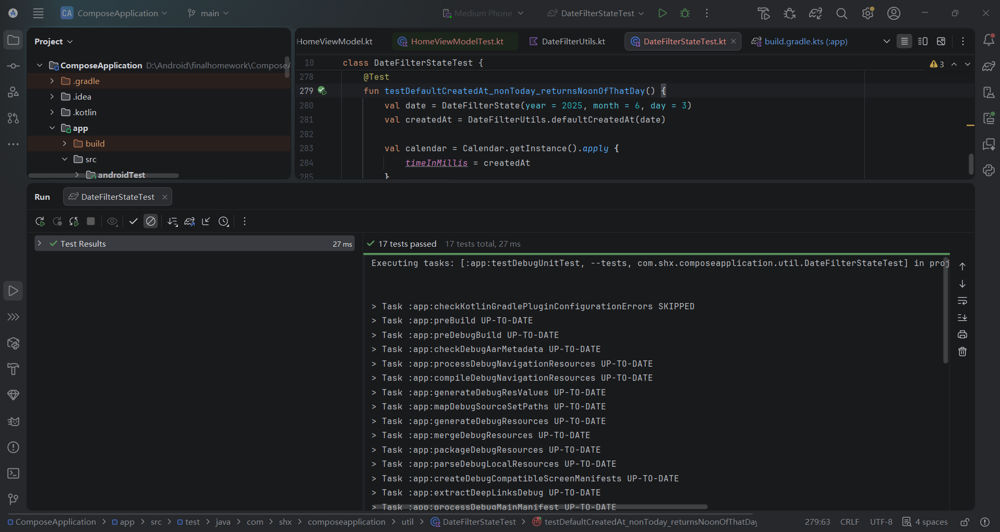
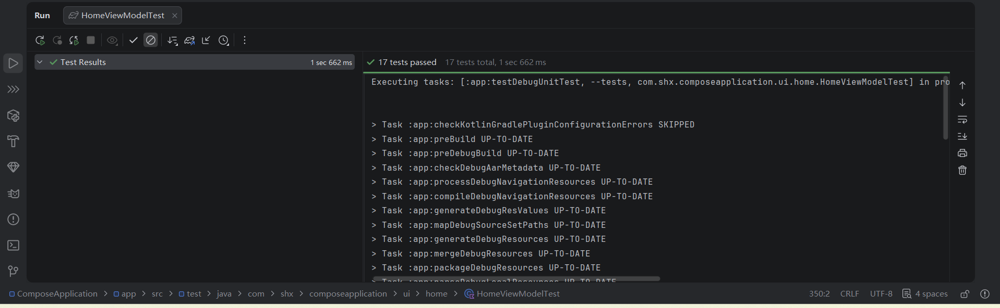

## 一、测试概述

本次单元测试采用 **JUnit4 + MockK + Turbine** 框架，对应用的三个核心模块进行了测试：

| 模块 | 测试类 | 测试方法数 | 测试类型 |
|------|--------|-----------|----------|
| 数据层 | `AccountRepositoryTest` | 7 | 仪器化测试 |
| 工具层 | `DateFilterUtilsTest` | 17 | 本地单元测试 |
| 业务层 | `HomeViewModelTest` | 17 | 本地单元测试 |

**总计：41 个测试方法，全部通过 ✅**

---

## 二、测试环境依赖

```kotlin
// build.gradle.kts 中的测试依赖
testImplementation("org.jetbrains.kotlinx:kotlinx-coroutines-test:1.7.3")
testImplementation("androidx.arch.core:core-testing:2.2.0")
testImplementation("io.mockk:mockk:1.13.8")
testImplementation("androidx.room:room-testing:2.6.1")// Room 测试支持（用于内存数据库）
testImplementation("androidx.arch.core:core-testing:2.2.0")
testImplementation("app.cash.turbine:turbine:1.0.0")
```
## 三、测试1：AccountRepositoryTest（数据层）
### 3.1测试目标
验证 AccountRepository 类的所有数据库操作是否正确，包括：

增（Insert）、删（Delete）、改（Update）、查（Query）、按日期筛选 、批量操作

### 3.2 测试方法
|序号	|测试方法	|测试内容	|预期结果|
|------|--------|-----------|----------|
|1	|testInsertAndQueryById	|插入记录后通过ID查询	|查询结果与插入数据一致|
|2	|testObserveAllReturnsAllRecords	|查询所有记录	|返回全部插入的记录|
|3	|testUpdateRecord	|更新记录	|更新后的数据正确|
|4	|testDeleteRecord	|删除记录	|删除后查询结果为null|
|5	|testObserveByDay	|按天查询记录	|只返回当天的记录|
|6	|testObserveByMonth	|按月查询记录	|只返回当月的记录|
|7	|testClearAll	|清空所有记录	|清空后记录数为0|

### 3.3 测试截图


## 四、测试2：DateFilterUtilsTest（工具层）
### 4.1 测试目标
验证 DateFilterUtils 工具类的所有日期计算和格式化功能是否正确：

日期范围计算 、日期格式化 、日期合法性校验 、时间戳转换

### 4.2 测试方法
|序号	|测试方法	|测试内容	|预期结果|
|------|--------|-----------|----------|
|1	|testDayRangeMillis_returnsCorrectRange	|获取当天时间戳范围	|起止时间正确|
|2	|testDayRangeMillis_crossMonthBoundary	|跨月边界测试	|结束日期为下月1号|
|3	|testMaxDayInMonth_returnsCorrectMaxDay	|获取当月最大天数	|1月31天，2月28/29天|
|4	|testClampDay_restrictsDayToValidRange	|日期修正	|超出范围时自动修正|
|5	|testFormatDayLabel_returnsCorrectFormat	|日期格式化	|"2026年6月3日"|
|6	|testFormatDisplayLabel_todayShowsSpecialFormat	|今天特殊格式	|"今天 · 6月3日"|
|7	|testFormatDisplayLabel_nonTodayShowsNormalFormat	|非今天格式	|"2000年1月1日"|
|8	|testToday_returnsCurrentDate	|获取今天日期	|与系统日期一致|
|9	|testIsToday_returnsTrueForToday	|判断是否今天	|今天是true，其他日期false|
|10	|testPickerMillisConversion_isReversible	|时间戳互转	|转换前后数据一致|
|11	|testMonthRangeMillis_returnsCorrectMonthRange	|获取月份范围	|起止时间正确|
|12	|testMonthRangeMillis_crossYearBoundary	|跨年边界测试	|结束年份+1|
|13	|testFormatMonthLabel_returnsCorrectFormat	|月份格式化	|"2026年6月"|
|14	|testPickerYearRange_returnsCorrectRange	|年份选择范围	|2020 ~ 当前年|
|15	|testCurrentYearMonth_returnsCurrentYearAndMonth	|获取当前年月	|与系统年月一致|
|16	|testDefaultCreatedAt_today_returnsCurrentTime	|今天默认时间戳	|当前时间±1秒|
|17	|testDefaultCreatedAt_nonToday_returnsNoonOfThatDay	|非今天默认时间	|当天中午12点|

### 4.3 测试截图


## 五、测试3：HomeViewModelTest（业务层）
### 5.1 测试目标
验证 HomeViewModel 的所有业务逻辑是否正确：

日期选择与切换 、对话框状态管理 、账单增删改查 、输入校验 、统计数据计算

### 5.2 测试方法
|序号	|测试方法	|测试内容	| 预期结果       |
|--|--------|-----------|------------|
|1	|initialSelectedDate_shouldBeToday	|初始选中日期	| 为今天        |
|2	|onDateChange_updatesSelectedDate	|修改选中日期	| 日期正确更新     |
|3	|onDateChange_clampsInvalidDay	|无效日期修正	| 自动修正为有效日期  |
|4	|onTodayClick_returnsToToday	|点击今天按钮	| 回到今天       |
|5	|onAddClick_showsFormDialog	|打开添加对话框	| 显示空白表单     |
|6	|onEditClick_populatesFormWithRecordData	|打开编辑对话框	| 表单填充已有数据   |
|7	|onEditClick_formatsIntegerAmountWithoutDecimal	|金额格式化	| 整数金额无小数点   |
|8	|onDeleteClick_showsDeleteConfirmDialog	|打开删除确认	| 显示确认对话框    |
|9	|onDismissDialog_hidesDialog	|关闭对话框	| 对话框隐藏      |
|10|onSaveForm_withValidData_insertsRecord	|保存有效记录	| 调用insert方法 |
|11|onSaveForm_withEmptyAmount_showsError	|金额为空	| 显示错误提示     |
|12|onSaveForm_withZeroAmount_showsError	|金额为0	| 显示错误提示     |
|13|onSaveForm_withEmptyCategory_showsError	|分类为空	| 显示错误提示     |
|14|onSaveForm_withExistingId_updatesRecord	|更新记录	| 调用update方法 |
|15|onConfirmDelete_deletesRecord	|确认删除	| 调用delete方法 |
|16|summary_calculatesCorrectly	|统计数据	| 收入/支出/结余正确 |
|17|onDismissError_clearsErrorMessage	|清除错误	| 错误信息清空     |

### 5.3问题与解决
turbine 在等待 Flow 发射数据时超时了。这是因为 uiState 的初始值在订阅后没有立即发射。

**问题分析**
- uiState 使用 stateIn 且 SharingStarted.WhileSubscribed(5000)：这意味着 Flow 只有在有订阅者时才开始发射，且需要等待 5 秒的停止超时。在测试中，turbine.test 订阅后，Flow 可能没有立即发射数据。
- 统计测试失败：因为 repository.observeByDay() 返回的 Flow 没有正确触发 uiState 的更新。

**修复方案**

修改 ViewModel
在 HomeViewModel.kt 中，将 stateIn 的 started 参数改为 SharingStarted.Eagerly：

```kotlin
// 原来的代码
}.stateIn(
scope = viewModelScope,
started = SharingStarted.WhileSubscribed(5_000),  // ← 问题所在
initialValue = HomeUiState()
)
// 修改为（仅用于测试，可以保持原样，测试中用特殊方式处理）
}.stateIn(
scope = viewModelScope,
started = SharingStarted.Eagerly,  // ← 立即开始
initialValue = HomeUiState()
)

```

### 5.4测试截图



